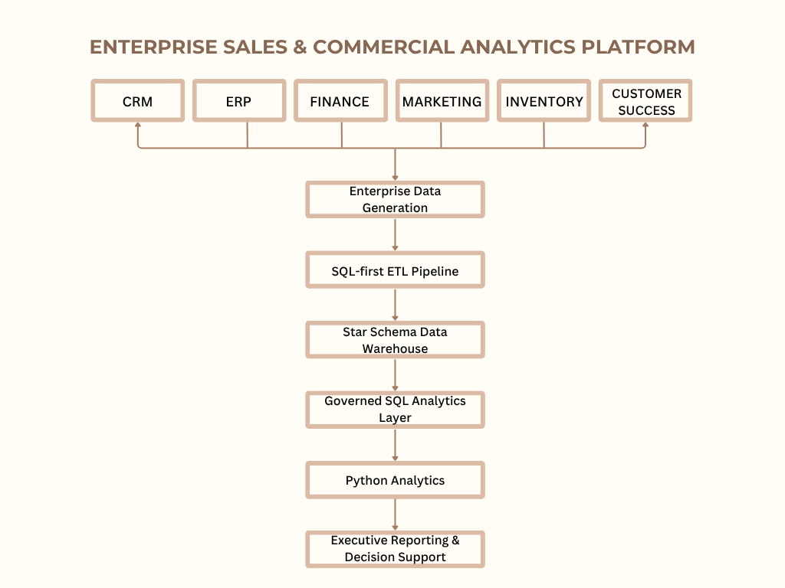
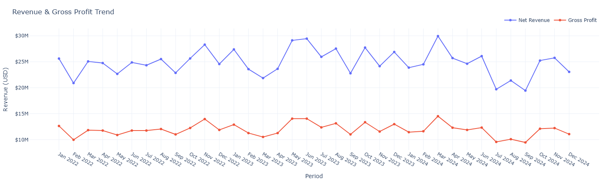
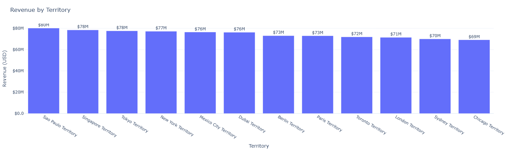
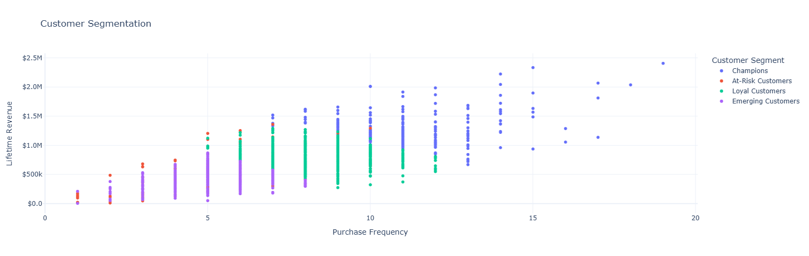
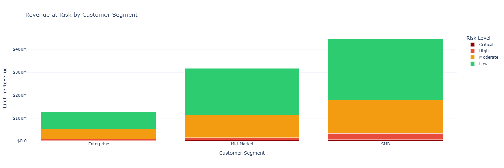
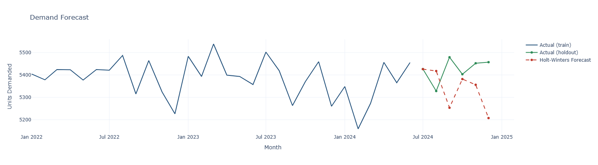

# Enterprise Sales & Commercial Analytics Platform

A SQL-first enterprise analytics platform that consolidates data across Sales, Finance, Marketing, Inventory, and Customer Success to deliver consistent KPI reporting and executive decision support.

---

## Project Overview

**Business Problem**
Commercial data is spread across multiple operational systems, making it difficult to produce consistent KPIs, reliable reports, and a unified view of business performance.

**Solution**
Built a SQL-first enterprise analytics platform using a Star Schema data warehouse, an ETL pipeline, governed SQL views, and Python analytics to centralize reporting and standardize business metrics.

**Business Value**
Provides a single, trusted reporting foundation that improves KPI consistency, reduces manual reporting effort, and supports faster, data-driven decision-making across Sales, Finance, Marketing, Inventory, and Customer Success.

---
## Business Problem

Commercial organizations rely on multiple operational systems to manage sales, finance, marketing, inventory, and customer success. While each system supports a specific business function, reporting across them is often inconsistent because data is stored, calculated, and interpreted independently.

This creates several business challenges:

- Different departments report different versions of the same KPI.
- Revenue and profitability require manual reconciliation across multiple systems.
- Reporting depends heavily on spreadsheets and repetitive manual processes.
- Decision-makers lack a consolidated view of commercial performance.
- Without a centralized analytical platform, cross-functional reporting becomes slow, inconsistent, and difficult to scale.

---

## Project Objectives

This project was developed to:

- Build a centralized analytics platform for commercial reporting.
- Establish a single, governed source for enterprise KPI reporting.
- Design a scalable Star Schema data warehouse with a SQL-first ETL pipeline.
- Deliver business insights through advanced SQL analytics, visualization, customer analytics, and demand forecasting.
- Demonstrate an end-to-end enterprise analytics solution that reflects modern business intelligence practices.
---

## Solution Architecture

The platform consolidates operational data from multiple enterprise systems into a centralized analytical warehouse. A SQL-first ETL pipeline prepares and standardizes the data before it is transformed into governed SQL analytics, Python-based reporting, executive dashboards, and business insights.

  

## Technology Stack

| Category | Technology |
|----------|------------|
| Development Environment | Visual Studio Code |
| Data Warehouse | SQLite |
| Query Language | SQL |
| Analytics | Python |
| Data Processing | Pandas, NumPy |
| Machine Learning | Scikit-learn, Statsmodels |
| Data Visualization | Plotly, Matplotlib |

---

## Key Features

- **Centralized Enterprise Data Warehouse** — Consolidates Sales, Finance, Marketing, Inventory, and Customer Success data into a unified Star Schema.
- **SQL-first ETL Pipeline** — Loads, validates, cleans, and transforms operational data into a governed analytical warehouse.
- **Automated Data Quality Auditing** — Detects duplicate records, missing values, orphaned keys, and business rule violations before warehouse loading.
- **Standardized KPI Reporting** — Uses governed SQL views to provide consistent business metrics across departments.
- **Advanced Business Analytics** — Combines SQL analytics with Python-based customer segmentation, retention analysis, demand forecasting, and executive reporting.
- **Executive Decision Support** — Delivers interactive dashboards, KPI scorecards, and business insights to support commercial decision-making.

---

## Data Warehouse Design

The platform is built on a **Star Schema** that separates descriptive business entities from transactional events. This dimensional model simplifies analytical queries, improves reporting performance, and provides a scalable foundation for enterprise business intelligence.

| Layer | Description |
|--------|-------------|
| **Dimension Tables (10)** | Store descriptive business information such as customers, products, sales representatives, suppliers, dates, regions, channels, and promotions. |
| **Fact Tables (8)** | Capture measurable business events including sales, orders, opportunities, marketing campaigns, inventory, forecasts, returns, and customer activity. |

---

## ETL Pipeline

The platform uses a SQL-first ETL pipeline to prepare operational data for analytical reporting. Raw data is staged, validated, cleansed, and loaded into the warehouse through a structured process that ensures consistency before it is used for reporting and analytics.

- **Staging** – Loads raw source data into staging tables before transformation.
- **Data Quality Validation** – Detects duplicate records, missing values, orphaned keys, and business rule violations before warehouse loading.
- **Warehouse Loading** – Cleansed and validated data is loaded into the Star Schema while preserving referential integrity.
- **Audit Logging** – Every validation check is recorded to provide a traceable history of data quality across ETL runs.

---

## SQL Analytics

SQL serves as the analytical foundation of the platform, transforming warehouse data into standardized business metrics, reusable reporting objects, and executive-ready insights.

- **Governed SQL Views** – Standardize KPI calculations for revenue, profitability, pipeline health, marketing performance, inventory, and customer analytics to ensure consistent reporting across business functions.
- **Advanced Analytical Queries** – Apply window functions to generate sales rankings, running totals, moving averages, revenue growth trends, and customer value segmentation.
- **Recursive CTEs & Aggregated Reporting** – Build fiscal reporting calendars and multi-level business summaries for executive reporting.
- **Query Optimization** – Validate query performance using indexing strategies and execution plans for high-volume analytical workloads.
- **Executive KPI Reporting** – Deliver standardized metrics including revenue, gross margin, year-over-year growth, pipeline coverage, customer health, and inventory risk.

---

## Python Analytics

Python extends the SQL analytics layer with advanced analytical models and interactive visualizations that support executive reporting, customer intelligence, and operational planning.

- **Executive Visualizations** – Interactive dashboards transform SQL outputs into business-ready reports, highlighting revenue performance, sales trends, territory performance, customer mix, and pipeline health.
- **Customer Segmentation** – RFM analysis and K-Means clustering identify behavioral customer segments to support targeted sales and customer engagement strategies.
- **Customer Retention Analysis** – A business-driven risk model combines purchasing behaviour, customer health, CSAT, escalations, and support activity to identify accounts requiring proactive retention efforts.
- **Demand Forecasting** – Historical demand is analyzed using Holt-Winters forecasting to support inventory planning, forecast evaluation, and supply chain decision-making.

---

## Executive KPI Summary

The following KPIs summarize the overall commercial performance of the platform based on the generated enterprise dataset.

| KPI | Value |
|------|------:|
| Total Net Revenue | $894,445,716 |
| Total Gross Profit | $428,625,354 |
| Blended Gross Margin | 47.92% |
| 2023 YoY Revenue Growth | 5.07% |
| 2024 YoY Revenue Growth | -6.69% |
| Open Pipeline Value | $127,437,780 |
| Pipeline Coverage Ratio | 0.44× |

> *KPI values are generated from the project's synthetic enterprise dataset and will vary if the dataset is regenerated.*

---

## Executive Visualizations

Interactive visualizations transform analytical outputs into business-ready insights, providing a clear view of commercial performance, customer behaviour, and operational trends.

### Revenue & Performance

*Monthly net revenue and gross profit trends.*

*Regional revenue performance across sales territories.*

### Customer Analytics

*RFM-based customer segmentation using K-Means clustering.*

*Revenue exposure by customer retention risk level.*

### Forecasting

*Actual demand compared with Holt-Winters demand forecasting.*

## Key Business Insights

- Revenue growth declined from **5.07% in 2023** to **−6.69% in 2024**, indicating weaker commercial momentum.
- A pipeline coverage ratio of **0.38×** is well below the commonly accepted **3–4× benchmark**, highlighting the need to strengthen pipeline generation.
- Customer segmentation identifies a relatively small group of high-value customers alongside a larger at-risk segment, emphasizing the importance of proactive retention strategies.
- Inventory analytics highlights products with elevated stockout risk, creating opportunities to improve demand planning and supplier performance.
- Executive dashboards consolidate cross-functional KPIs into a single reporting layer, enabling faster and more consistent business decision-making.

---

## Business Recommendations

- Strengthen pipeline generation to improve future revenue growth and increase pipeline coverage.
- Prioritize proactive retention strategies for high-value customer accounts identified through the retention analysis.
- Use customer segmentation to deliver targeted sales, marketing, and customer success initiatives for each customer group.
- Improve inventory planning by combining demand forecasting with supplier performance monitoring to reduce stockout risk.
- Standardize KPI reporting across business functions using the governed SQL analytics layer to ensure consistent decision-making.

---

## Future Improvements

- Replace the synthetic dataset with data from a live operational system to support real-time reporting.
- Automate the ETL pipeline using incremental data loading instead of full refreshes.
- Extend the forecasting model by incorporating additional business and seasonal factors.
- Explore machine learning models for customer retention using historical customer behaviour.
- Migrate the warehouse to a production database such as PostgreSQL or Snowflake for improved scalability.

---

## Project Summary

This project brings together enterprise data warehousing, SQL analytics, and Python-based analytics to build a unified commercial intelligence platform.

A SQL-first ETL pipeline, Star Schema data warehouse, governed SQL views, and Python analytics work together to transform operational data into standardized KPI reporting, executive dashboards, customer analytics, and demand forecasting.

The result is an end-to-end analytics solution that demonstrates how modern organizations can centralize reporting, improve decision-making, and turn operational data into actionable business insights.

---